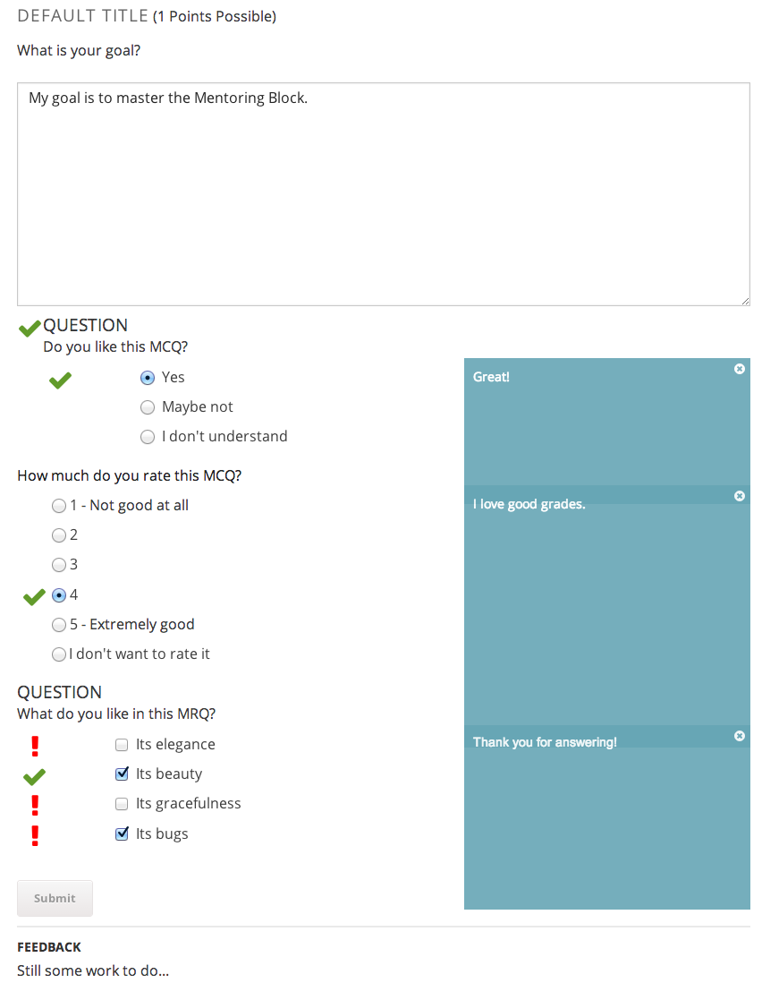

Mentoring XBlock
----------------

[](https://travis-ci.org/open-craft/xblock-mentoring)

This XBlock allows to automate the workflow of real-life mentoring,
within an edX course.

It supports:

* **Free-form answers** (textarea) which can be shared accross
  different XBlock instances (for example, to allow a student to
  review and edit an answer he gave before).
* **Self-assessment MCQs** (multiple choice), to display predetermined
  feedback to a student based on his choices in the
  self-assessment. Supports rating scales and arbitrary answers.
* **MRQs (Multiple Response Questions)**, a type of multiple choice
  question that allows the student to choose more than one choice.
* **Answer recaps** that display a read-only summary of a user's
  answer to a free-form question asked earlier in the course.
* **Progression tracking**, to require that the student has
  completed a particular step before allowing them to complete the
  next step. Provides a link to the next step to the student.
* **Tables**, which allow to present answers from the student to
  free-form answers in a concise way. Supports custom headers.
* **Dashboards**, for displaying a summary of the student's answers
  to multiple choice questions. [Details](doc/Dashboard.md)

The screenshot shows an example of a mentoring block containing a
free-form question, two MCQs and one MRQ.



Installation
------------

Install the requirements into the python virtual environment of your
`edx-platform` installation by running the following command from the
root folder:

```bash
$ pip install -r requirements.txt
```

Enabling in Studio
------------------

You can enable the Mentoring XBlock in studio through the advanced
settings.

1. From the main page of a specific course, navigate to `Settings ->
   Advanced Settings` from the top menu.
2. Check for the `advanced_modules` policy key, and add `"mentoring"`
   to the policy value list.
3. Click the "Save changes" button.

Usage
-----
See [Usage Instructions](doc/Usage.md)

Workbench installation and settings
-----------------------------------

Install to the workbench's virtualenv by running the following command form the mentoring repo root:

```bash
pip install -r requirements.txt
```

In the main XBlock repository, create the following configuration file
in `workbench/settings_mentoring.py` in the XBlock repository:

```python
from settings import *

INSTALLED_APPS += ('mentoring',)
DATABASES['default']['NAME'] = 'workbench.sqlite'
```

Because this XBlock uses a Django model, you need to sync the database
before starting the workbench. Run this from the XBlock repository
root:

```bash
$ ./manage.py syncdb --settings=workbench.settings_mentoring
```

Running the workbench
---------------------

```bash
$ ./manage.py runserver 8000 --settings=workbench.settings_mentoring
```

Access it at [http://localhost:8000/](http://localhost:8000).

Running tests
-------------

First, make sure the [XBlock SDK (Workbench)](https://github.com/edx/xblock-sdk)
is installed in the same virtual environment as xblock-mentoring.

From the xblock-mentoring repository root, run the tests with the
following command:

```bash
$ ./run_tests.py
```

If you want to run only the integration or the unit tests, append the directory to the command. You can also run separate modules in this manner.

```bash
$ ./run_tests.py mentoring/tests/unit
```

Extracting Translatable Strings
-------------------------------

To extract/update strings for translation, you will need i18n_tools:

```bash
pip install git+https://github.com/edx/i18n-tools.git#egg=i18n_tools
```

To extract strings, use `i18n_tool extract`. To build a dummy translation for
testing, use:

```bash
i18n_tool dummy && i18n_tool generate
```


Adding custom scenarios to the workbench
----------------------------------------

Within the xblock-mentoring repository, create the `templates/xml` and
add XML scenarios to it - all files with the `*.xml` extension will be
automatically loaded by the workbench:

```bash
$ mkdir templates/xml
$ cat > templates/xml/my_mentoring_scenario.xml
```

Restart the workbench to take the new scenarios into account.

Upgrading from Version 1
------------------------

To upgrade a course from the earlier version of this XBlock, run the following
command on a system with edx-platform and xblock-mentoring installed:

```bash
$ SERVICE_VARIANT=cms DJANGO_SETTINGS_MODULE="cms.envs.devstack" python -m mentoring.v1.upgrade "Org/Course/Run"
```
Where "Org/Course/Run" is replaced with the ID of the course to upgrade.

License
-------

The Mentoring XBlock is available under the GNU Affero General
Public License (AGPLv3).
