Problem Builder Usage
=====================

When you add the **Problem Builder** component to a course in the
studio, the built-in editing tools guide you through the process of
configuring the block and adding individual questions.

### Problem Builder modes

There are 2 mentoring modes available:

* **standard**: Traditional mentoring. All questions are displayed on the
  page and submitted at the same time. The students get some tips and
  feedback about their answers. This is the default mode.

* **assessment**: Questions are displayed and submitted one by one. The
  students don't get tips or feedback, but only know if their answer was
  correct. Assessment mode comes with a default `max_attempts` of `2`.

**Note that assessment mode is deprecated**: In the future, Problem
Builder will only provide functionality that is currently part of
standard mode. Assessment mode will remain functional for a while to
ensure backward compatibility with courses that are currently using
it. If you want to use assessment functionality for a new course,
please use the Step Builder XBlock (described below).

Below are some LMS screenshots of a Problem Builder block in assessment mode.

Question before submitting an answer:

Question after submitting the correct answer:

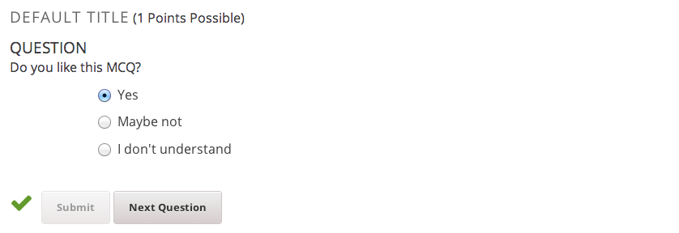

Question after submitting a wrong answer:

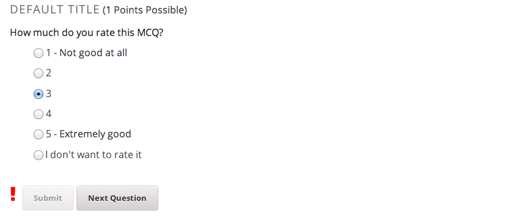

Score review and the "Try Again" button:

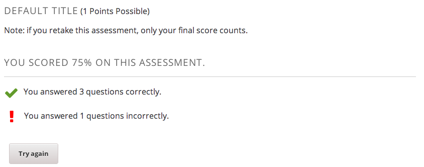

Step Builder Usage
==================

The Step Builder XBlock replaces assessment mode functionality of the
Problem Builder XBlock, while allowing to group questions into explict
steps:

Instead of adding questions to Step Builder itself, you'll need to add
one or more **Mentoring Step** blocks to Step Builder. You can then
add one or more questions to each step. This allows you to group
questions into logical units (without being limited to showing only a
single question per step). As students progress through the block,
Step Builder will display one step at a time. All questions belonging
to a step need to be completed before the step can be submitted.

In addition to regular steps, Step Builder also provides a **Review
Step** block which

* allows students to review their performance

* allows students to jump back to individual steps to review their
  answers (if **Extended feedback** setting is on and maximum number
  of attempts has been reached)

* supports customizable messages that will be shown when

  * the block is *complete*, i.e., if all answers that the student
    provided are correct
  * the block is *incomplete*, i.e., if some answers that the student
    provided are incorrect or partially correct
  * the student has used up all attempts

Note that only one such block is allowed per instance.

**Screenshots: Step**

Step with multiple questions (before submitting it):

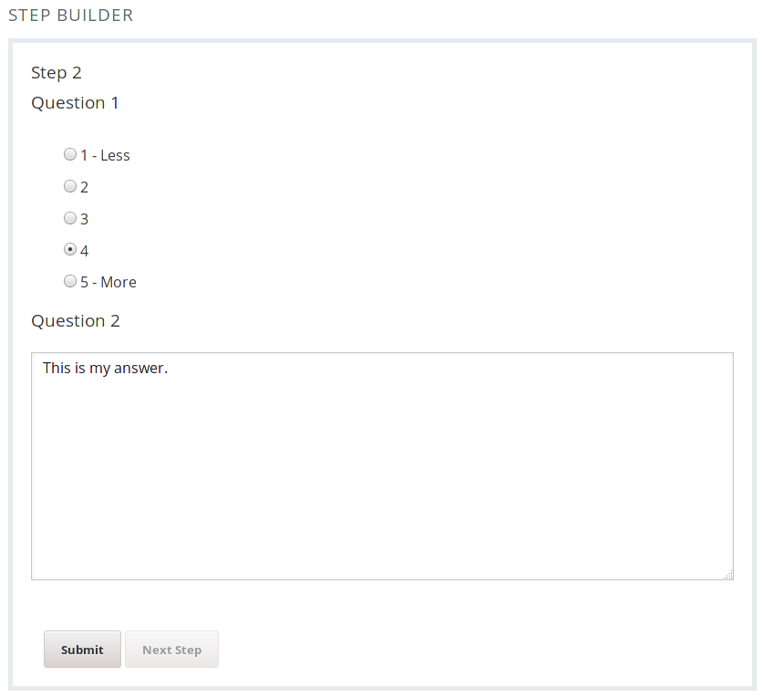

Step with multiple questions (after submitting it):

As indicated by the orange check mark, this step is *partially*
correct (i.e., some answers are correct and some are incorrect or
partially correct).

**Screenshots: Review Step**

Unlimited attempts available, all answers correct:

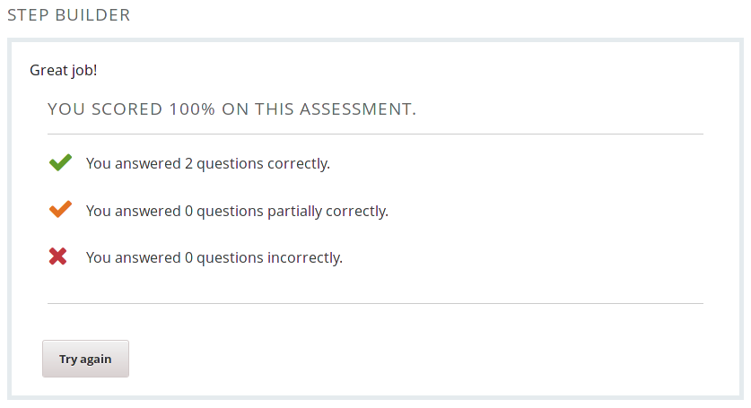

Limited attempts, some attempts remaining, some answers incorrect:

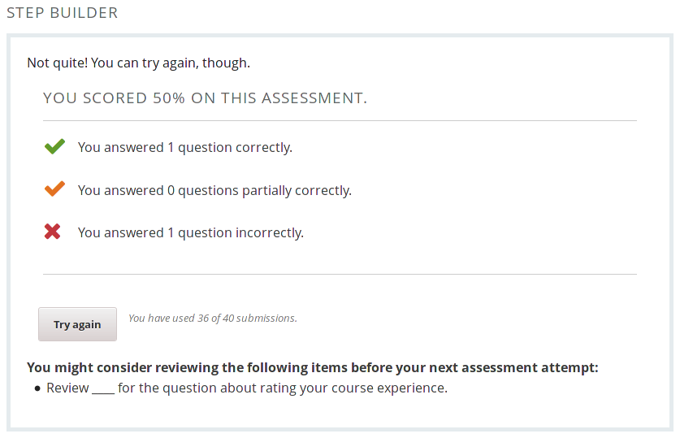

Limited attempts, no attempts remaining, extended feedback off:

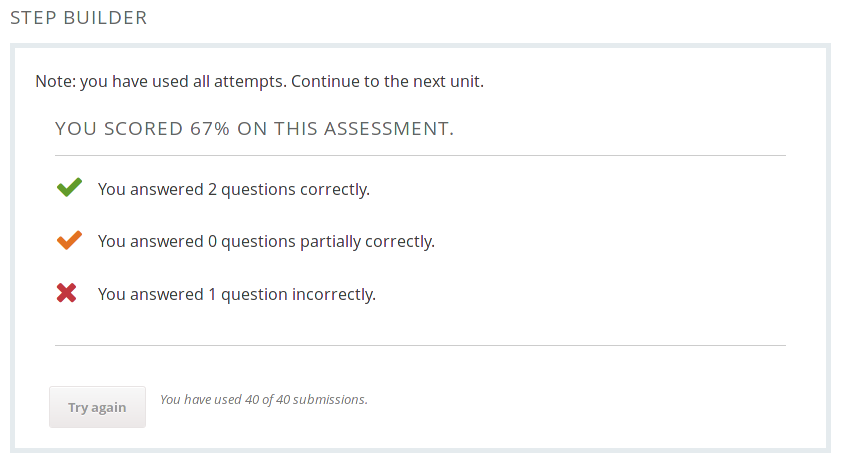

Limited attempts, no attempts remaining, extended feedback on:

**Screenshots: Step-level feedback**

Reviewing performance for a single step:

Question Types
==============

### Free-form Questions

Free-form questions are represented by a **Long Answer** component.

Example screenshot before answering the question:

Screenshot after answering the question:

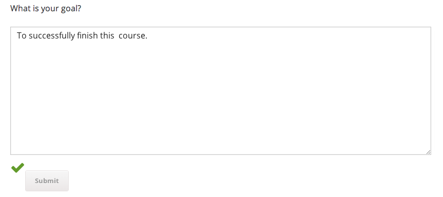

You can add **Long Answer Recap** components to problem builder blocks
later on in the course to provide a read-only view of any answer that
the student entered earlier.

The read-only answer is rendered as a quote in the LMS:

### Multiple Choice Questions (MCQs)

Multiple Choice Questions can be added to a problem builder component and
have the following configurable options:

* **Question** - The question to ask the student
* **Message** - A feedback message to display to the student after they
  have made their choice.
* **Weight** - The weight is used when computing total grade/score of
  the problem builder block. The larger the weight, the more influence this
  question will have on the grade. Value of zero means this question
  has no influence on the grade (float, defaults to `1`).
* **Correct Choice[s]** - Specify which choice[s] are considered correct. If
  a student selects a choice that is not indicated as correct here,
  the student will get the question wrong.

Using the Studio editor, you can add **Custom Choice** blocks to an
MCQ. Each Custom Choice represents one of the options from which
students will choose their answer.

You can also add **Tip** entries. Each Tip must be configured to link
it to one or more of the choices. If the student selects a choice, the
tip will be displayed.

**Screenshots**

Before attempting to answer the questions:

While attempting to complete the questions:

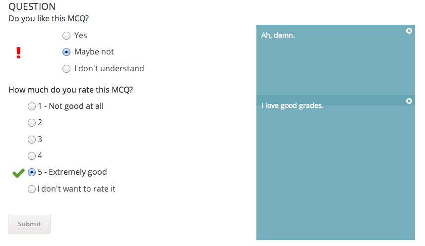

After successfully completing the questions:

#### Rating Questions

When constructing questions where the student rates some topic on the
scale from `1` to `5` (e.g. a Likert Scale), you can use the Rating
question type, which includes built-in numbered choices from 1 to 5
The `Low` and `High` settings specify the text shown next to the
lowest and highest valued choice.

Rating questions are a specialized type of MCQ, and the same
instructions apply. You can also still add **Custom Choice** components
if you want additional choices to be available such as "I don't know".

### Self-assessment Multiple Response Questions (MRQs)

Multiple Response Questions are set up similarly to MCQs. The answers
are rendered as checkboxes. Unlike MCQs where only a single answer can
be selected, MRQs allow multiple answers to be selected at the same
time.

MRQ questions have these configurable settings:

* **Question** - The question to ask the student
* **Required Choices** - For any choices selected here, if the student
  does *not* select that choice, they will lose marks.
* **Ignored Choices** - For any choices selected here, the student will
  always be considered correct whether they choose this choice or not.
* Message - A feedback message to display to the student after they
  have made their choice.
* **Weight** - The weight is used when computing total grade/score of
  the problem builder block. The larger the weight, the more influence this
  question will have on the grade. Value of zero means this question
  has no influence on the grade (float, defaults to `1`).
* **Hide Result** - If set to `True`, the feedback icons next to each
  choice will not be displayed (This is `False` by default).

The **Custom Choice** and **Tip** components work the same way as they
do when used with MCQs (see above).

**Screenshots**

Before attempting to answer the questions:

While attempting to answer the questions:

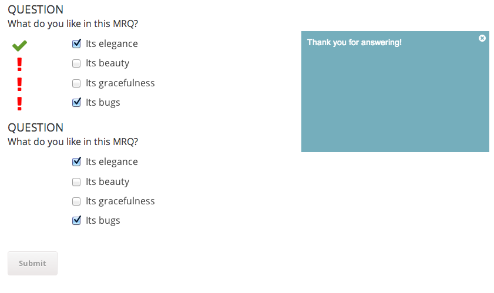

After clicking on the feedback icon next to the "Its bugs" answer:

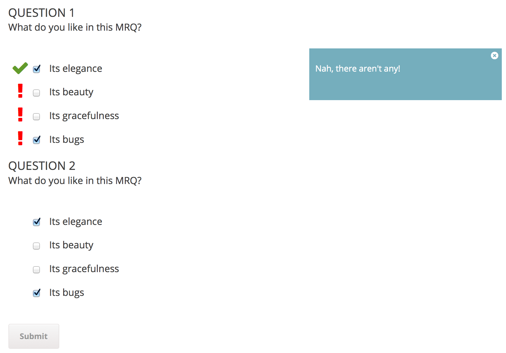

After successfully completing the questions:

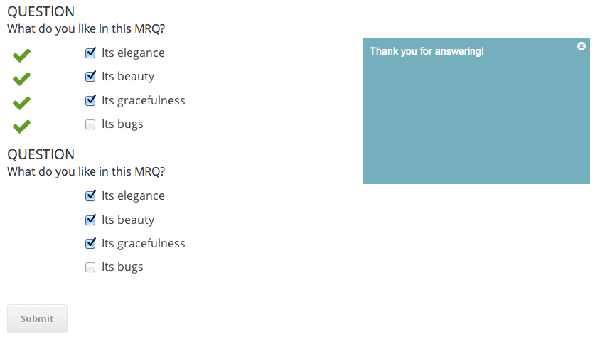

Other Components
================

### Tables

Tables allow you to present answers to multiple free-form questions in
a concise way. Once you create an **Answer Recap Table** inside a
Mentoring component in Studio, you will be able to add columns to the
table. Each column has an optional **Header** setting that you can use
to add a header to that column. Each column can contain one or more
**Answer Recap** elements, as well as HTML components.

Screenshot:

### "Dashboard" Self-Assessment Summary Block

[Instructions for using the "Dashboard" Self-Assessment Summary Block](Dashboard.md)

Configuration Options
====================

### Maximum Attempts

You can limit the number of times students are allowed to complete a
Mentoring component by setting the **Max. attempts allowed** option.

Before submitting an answer for the first time:

After submitting a wrong answer two times:

### Custom Window Size for Tip Popups

You can specify **Width** and **Height** attributes of any Tip
component to customize the popup window size. The value of those
attributes should be valid CSS (e.g. `50px`).
